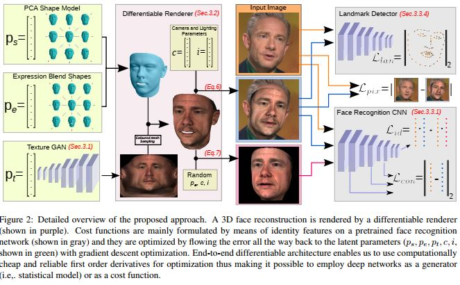
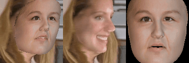
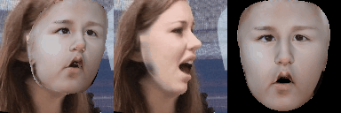
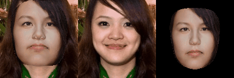
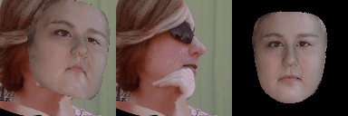
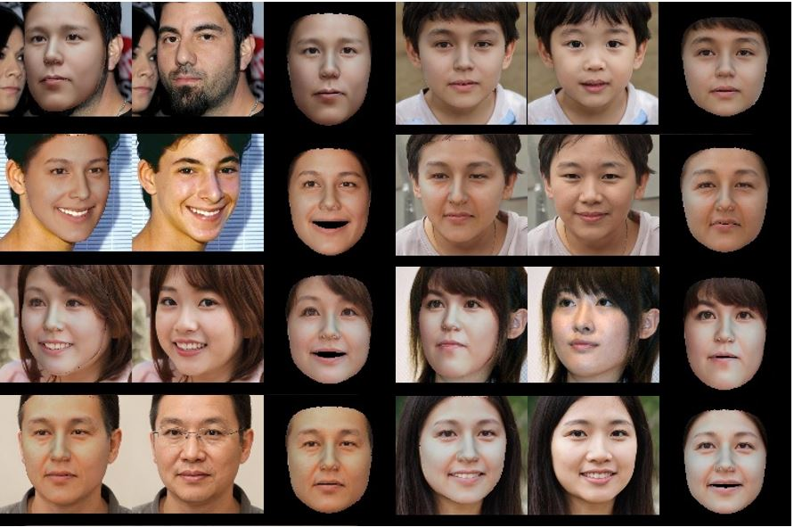

### GANFIT: Generative Adversarial Network Fitting for High Fidelity 3D Face Reconstruction   

<p align="center"></p> 

## Results of mine   
The effect is not too bad, lack of data is the biggest problem!    
* #### Some were converted into neutral expressions.  
    
    
    
    
  
* #### retain original expressions. The concrete implementaion is different from the paper.  
  

## Citation   
 [paper_link](http://openaccess.thecvf.com/content_CVPR_2019/html/Gecer_GANFIT_Generative_Adversarial_Network_Fitting_for_High_Fidelity_3D_Face_CVPR_2019_paper.html)  

```  
@InProceedings{Gecer_2019_CVPR,  
author = {Gecer, Baris and Ploumpis, Stylianos and Kotsia, Irene and Zafeiriou, Stefanos},  
title = {GANFIT: Generative Adversarial Network Fitting for High Fidelity 3D Face Reconstruction},  
booktitle = {The IEEE Conference on Computer Vision and Pattern Recognition (CVPR)},  
month = {June},  
year = {2019}   
}  

```  